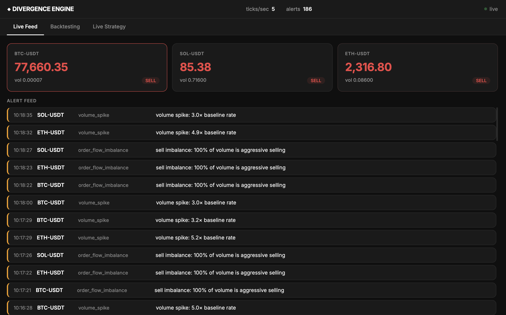
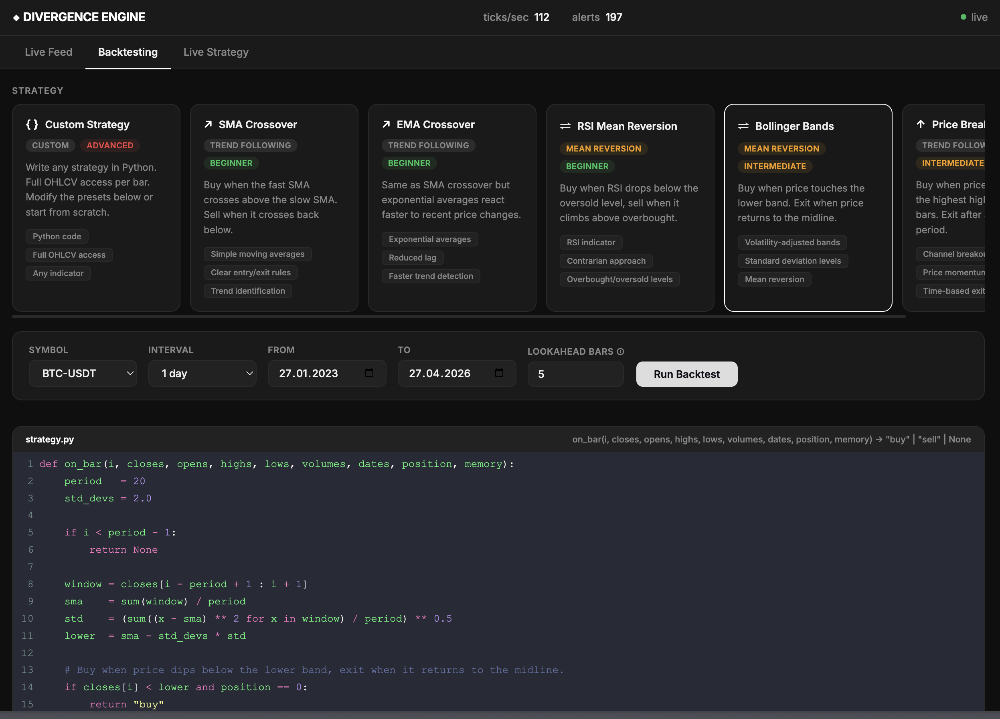
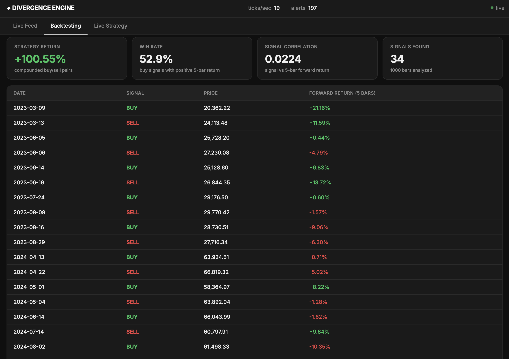
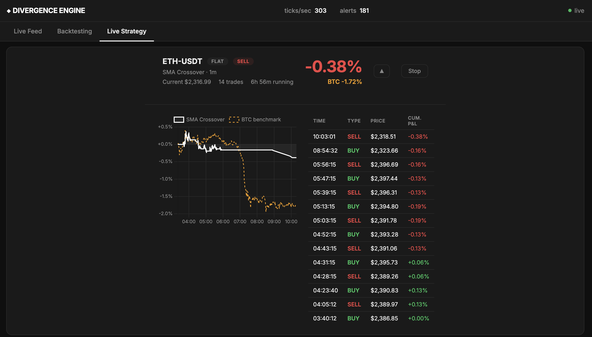
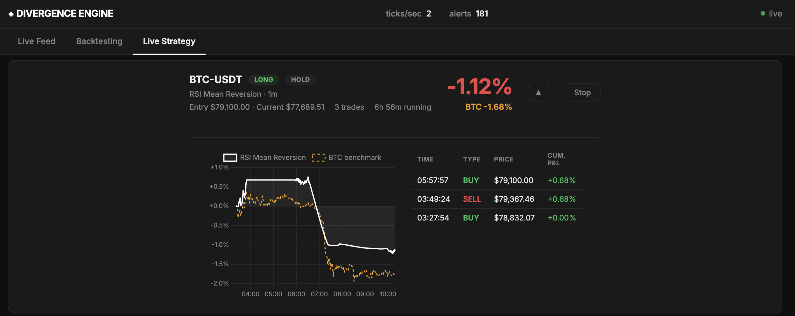

# Divergence Engine

This is a real-time crypto market analytics system built in Go. It pulls live trade data from Binance using WebSockets, runs various statistical detectors to spot anomalies like volume spikes, order flow imbalances, and correlation breakdowns, then sends alerts through a web dashboard. Everything runs in Docker and can scale by adding more detector workers.

## What It Does

The engine handles a bunch of tasks to keep an eye on crypto markets:

- **Data Ingestion**: Connects to Binance's WebSocket API to grab real-time trade ticks for symbols like BTC-USDT, ETH-USDT, and SOL-USDT. It handles reconnections automatically if the connection drops.

- **Detection**: Runs multiple detectors on the incoming data stream:
  - Volume Spike: Spots sudden jumps in trading volume that might signal big moves.
  - Order Flow Imbalance: Looks for imbalances between buy and sell orders that could indicate market pressure.
  - Correlation Breakdown: Tracks how different assets correlate and flags when those relationships break down unexpectedly.

- **Alerting**: When a detector finds something, it sends an alert. The system aggregates these, removes duplicates within a minute, and pushes them out.

- **Dashboard**: A simple web interface shows alerts in real-time using Server-Sent Events. It also lets you run backtests on historical data and simulate live trading strategies with fake money.

- **Backtesting Engine**: Evaluates strategies on historical Binance candle data using SMA/EMA crossovers, RSI mean reversion, Bollinger Bands, and breakout rules. It returns signal lists, win rate, forward returns, and strategy performance metrics.

- **Live Strategy Simulator**: Runs a stateful paper-trading session against recent Binance data. It executes buy/sell decisions, tracks PnL, trade count, and total account value over time.

## Concurrency in Go

Each service is built around a few Go concurrency patterns rather than a framework. The ingester pairs a WebSocket reader goroutine with a Redis publisher goroutine connected by a buffered channel, so backpressure from Redis flows naturally back to the socket. Detector workers subscribe to the same Redis Stream as one consumer group, which means Redis distributes ticks between them and scaling out is a Compose flag rather than a code change. Per-symbol state sits behind a sharded map so writes to different symbols don't contend on the same lock. A root `context.Context` threads through every goroutine, so SIGINT drains in-flight work cleanly with no leaks. A background `XAUTOCLAIM` loop in each worker reclaims messages abandoned by dead siblings, which is what makes failure recovery automatic. The whole system runs around 70 goroutines across 6 containers, coordinated through Redis Streams and channels, with no shared memory between services.

## Benchmarks

### Scaling

Constant load of 5000 ticks/sec for 90 seconds, adding a detector worker every 20s.

With **1 worker**, consumption tops out around 2000/sec. The system can't keep up, pending messages accumulate, and lag climbs to 1.8 seconds by second 20.

At second 20 a **second worker** joins. Combined consumption spikes to 6062/sec as both workers drain the backlog. Within two seconds, lag drops to 1ms and pending settles at 2 or 3. Adding a third and fourth worker later in the run causes no disruption, with lag staying under 2ms throughout.

| Phase | Workers | Consumption | Lag |
|---|---|---|---|
| Saturated | 1 | ~2000/s | growing to 1846ms |
| Recovery | 2 | 6062/s spike | drops to 0ms |
| Steady state | 2 to 4 | matches load | 0 to 2ms |

Workers are interchangeable, Redis Streams handles distribution, and `docker compose up --scale detector=N` is the entire scaling interface.

### Failure recovery

Steady 300 ticks/sec with one worker. After 30 seconds of normal operation, the worker was killed with `docker kill`, left dead for 20 seconds, then restarted.

While the worker is dead, consumption drops to zero and lag grows by one second per second of clock time, hitting 20 seconds of backlog. When the new worker rejoins the consumer group, it reclaims the abandoned messages and processes 3500 ticks in one second to drain the backlog. Lag returns to 2ms by the next sample.

| Phase | Consumption | Lag |
|---|---|---|
| Normal | ~300/s | 1 to 3ms |
| Worker dead | 0/s | grows to 20s |
| After restart | 3500/s spike | drops to 2ms |

**No messages are lost. Redis holds them in the stream and reassigns them when a consumer comes back, which is the guarantee consumer groups provide.**

---

About 60% the length, same content, no fluff. The graphs (when you add them) will carry a lot of the explanation, so the prose can stay this lean.

## Tech Stack

- Go for all the services (ingester, detectors, aggregator, dashboard)
- Redis Streams as the message bus between components
- Docker and Docker Compose for running everything
- Binance WebSocket API for live data
- Server-Sent Events for real-time updates in the browser
- Just two external libraries: gorilla/websocket and go-redis/v9

## Architecture

This is the key data flow for the engine:

```
+-----------------+        +----------------+        +---------------------+
| Binance WebSocket| -----> | Binance Ingester| -----> | Redis Streams (tick) |
+-----------------+        +----------------+        +----------+----------+
                                                                 |
                                                                 v
                                                       +---------------------+
                                                       | Detector Workers     |
                                                       | (volume / orderflow |
                                                       |  / correlation)     |
                                                       +----------+----------+
                                                                 |
                                                                 v
                                         +----------------+   +--------------------+
                                         | Alerts Stream  |<--| Aggregator /       |
                                         | (cleaned, de-  |   | Deduper           |
                                         | duplicated)    |   +--------------------+
                                         +----------------+                |
                                                                                  v
                                                                          +----------------+
                                                                          | Dashboard      |
                                                                          | + SSE live UI  |
                                                                          | + Backtest API  |
                                                                          | + Live strategy |
                                                                          +----------------+
```

- The ingester receives live trade ticks from Binance and writes them into Redis Streams.
- Detector workers pull from the tick stream, run their anomalies and signal checks, then publish alerts.
- The aggregator reads alert events, removes duplicates, and forwards clean alerts into the dashboard stream.
- The dashboard consumes live alerts and also exposes backtest and live strategy APIs.

Detectors are pluggable: you can add new ones by implementing a simple interface.

## Dashboard

### Live Feed

Real-time price cards for BTC, SOL, and ETH with per-trade volume and side (buy/sell). The alert feed below streams anomaly detections as they fire. Volume spikes and order flow imbalances are  shown here, with the detector name and message for each.



### Backtesting — Strategy gallery and code editor

Built-in strategies to choose from, each with a description, difficulty badge, and the Python implementation loaded into the editor. Selecting any preset pre-fills the editor so you can read or modify the exact logic & dates before running. The custom card lets you write any strategy from scratch with full OHLCV access per bar.



### Backtesting — Results

SMA Crossover on BTC-USDT daily bars from early 2023 to mid-2024 returned +100.55% compounded across 34 signals with a 52.9% win rate. The signal table shows every buy and sell with the 5-bar forward return so you can see which individual trades drove the result.



### Live Strategy — SMA Crossover on ETH-USDT

SMA Crossover running on ETH-USDT at 1-minute bars over ~7 hours. The strategy finishes at -0.38% while buy-and-hold BTC dropped -1.72% over the same window. The chart shows the strategy going flat early and avoiding most of the decline, while the trade table on the right logs each entry and exit with the cumulative P&L at that moment.



### Live Strategy — RSI Mean Reversion on BTC-USDT

RSI Mean Reversion on BTC-USDT at 1-minute bars. The strategy caught the initial dip and briefly reached +1% before BTC sold off further, pulling the position to -1.12%. BTC buy-and-hold over the same period is -1.68%, so the strategy is still ahead on a relative basis despite the open drawdown.



## Getting Started

Make sure you have Docker and Docker Compose installed. Then:

```bash
docker compose up
```

Open http://localhost:8080 in your browser for the dashboard.

To build from source:

```bash
make build  # compiles all binaries to ./bin/
make test   # runs tests
make up     # starts services
```

## Usage

- **Ingester**: Pulls from Binance. Set SYMBOLS env var for different pairs, like SYMBOLS=BTC-USDT,ETH-USDT.

- **Detectors**: Scale them by adding more detector service replicas in Docker Compose. They share the work via Redis groups.

- **Dashboard**: 
  - View live alerts.
  - Backtest strategies on historical Binance data via `/api/backtest`.
  - Start and stop live strategy simulations with `/api/live-strategy/start` and `/api/live-strategy/stop`.
  - Monitor paper-trading sessions, including PnL, total value, and current signal.

- **Load Generator**: Run go run ./bench/loadgen -rate 1000 -duration 60s to simulate traffic.

- **Benchmarks**: Use make bench-scale to test scaling, or make bench-recovery to see how it handles failures.

## Backtesting and Live Strategy

- The dashboard can fetch historical Binance candle data and simulate strategy performance over a date range.
- Supported backtest strategies include:
  - SMA crossover
  - EMA crossover
  - RSI mean reversion
  - Bollinger Bands
  - Breakout
- Backtests return signal timestamps, forward returns, win rate, correlation, and total strategy return.
- Live strategy simulation is a paper-trading engine that polls recent Binance closes, generates buy/sell/hold signals, and tracks a notional account balance.
- Live sessions start/stop per symbol and broadcast updates to the dashboard with current price, PnL, trade count, and position state.

## Performance

On a standard laptop with one detector:

- Handles 3000 ticks per second across multiple symbols.
- Alerts show up in 1-3 milliseconds from tick to dashboard.
- No backlog buildup over long runs.
- Scales linearly by adding workers.

## Design Choices

- Redis Streams with consumer groups for reliable message handling. Workers ACK messages, and Redis retries if one dies.
- Online algorithms for stats, like Welford's for correlation, so it doesn't store huge histories.
- Sharded maps for state to avoid locks blocking everything.
- One Dockerfile builds all binaries, keeping images small (15MB).
- Minimal dependencies to keep things simple and fast.

## Future Plans

- Add a database for storing alerts history.
- Switch to Protobuf for quicker data transfer.
- Support more exchanges like Alpaca for stocks.
- More detectors and strategies.
